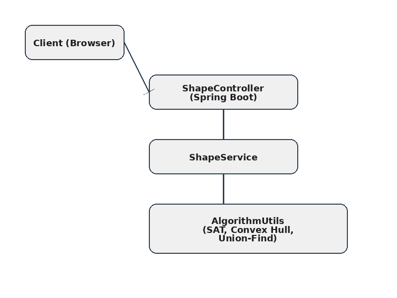

<!DOCTYPE html>
<html lang="ko">
<head>
  <meta charset="UTF-8">
  <meta name="viewport" content="width=device-width, initial-scale=1.0">
  <title>Shape Overlaps Detection System Portfolio</title>
  <link href="https://fonts.googleapis.com/css2?family=Inter:wght@400;600;700&display=swap" rel="stylesheet">
  
</head>
<body>

<header>
  <h1>Shape Overlaps Detection System</h1>
  
Comprehensive Project Portfolio

</header>

<section id="overview">
  <h2>1. 프로젝트 개요</h2>
  <h3>프로젝트 목적</h3>
  <ul class="stat-list">
    <li>다양한 형태(원, 다각형) 도형을 무작위로 생성하여 시각적으로 표현</li>
    <li>도형 간 겹침 그룹을 탐지하여 색상 및 통계 정보로 구분</li>
    <li>사용자 정의 파라미터(반지름, 개수, 면)를 실시간으로 조정하여 동적 시뮬레이션 지원</li>
    <li>웹 인터페이스를 통한 직관적 실시간 렌더링 및 JSON 데이터 모달 제공</li>
    <li>고해상도 SVG 벡터 그래픽으로 확대 시에도 선명한 시각화 구현</li>
  </ul>
  <h3>기술 스택</h3>
  <ul class="tech-list">
    <li><strong>Backend:</strong> Java 17, Spring Boot, Maven, Spring Web, Spring Data JPA, Lombok</li>
    <li><strong>Frontend:</strong> HTML5, CSS3, JavaScript (ES6), SVG, Jekyll</li>
    <li><strong>배포:</strong> GitHub Pages (Jekyll 기반), GitHub Actions (CI/CD)</li>
  </ul>
  <h3>시스템 아키텍처</h3>
  <pre>
Client (Browser) ←→ HTTP/REST ←→ ShapeController (Spring Boot)
                                   ↕
                          ShapeService
                                   ↕
                            AlgorithmUtils
                          (SAT, Convex Hull,
                           Union-Find)
  </pre>
  
</section>

<section id="tech-analysis">
  <h2>2. 기술 분석</h2>
  <h3>Spring Boot 구조 및 설계</h3>
  <ul class="tech-list">
    <li><strong>프로젝트 구조:</strong> src/main/java에 controller, service, repository, domain 패키지 배치</li>
    <li><strong>의존성 관리:</strong> Maven pom.xml에 Spring Web, Spring Data JPA, Lombok 설정</li>
    <li><strong>설계 패턴:</strong> Controller-Service-Repository 계층 분리</li>
  </ul>
  <h3>REST API 설계 원칙</h3>
  <ul class="tech-list">
    <li><strong>HTTP 메서드:</strong> GET, POST, PUT/PATCH, DELETE</li>
    <li><strong>URI 설계:</strong> /api/shapes, /api/statistics 등 리소스 기반</li>
    <li><strong>상태 코드:</strong> 200, 201, 400, 404, 500</li>
    <li><strong>HATEOAS:</strong> self 링크 제공 가능</li>
  </ul>
  <h3>객체지향 설계 적용 사례</h3>
  <ul class="tech-list">
    <li><strong>상속:</strong> BaseEntity 클래스 상속으로 id, createdAt, updatedAt 관리</li>
    <li><strong>다형성:</strong> Shape 인터페이스와 Circle, Polygon 클래스 구조</li>
    <li><strong>캡슐화:</strong> private 필드와 getter/setter로 데이터 은닉</li>
  </ul>
</section>

<section id="algorithms">
  <h2>3. 알고리즘 상세</h2>
  <h3>예비 필터링: Bounding Box</h3>
  
각 도형의 바운딩 박스(Bounding Box)를 먼저 비교하여 빠른 예비 검사 수행

  <h3>SAT (Separating Axis Theorem)</h3>
  <ol class="algo-list">
    <li>두 도형의 모든 엣지에 수직인 축(axis) 계산</li>
    <li>각 도형의 정점을 해당 축에 투영(projection)</li>
    <li>투영 구간이 분리되어 있으면 충돌 없음</li>
    <li>모든 축에서 겹치면 충돌 판정</li>
  </ol>
  <h3>컨벡스 헐 (Convex Hull)</h3>
  <ul class="tech-list">
    <li>Graham Scan: 점 집합 정렬 후 스택 방식으로 볼록 껍질 계산 (O(n log n))</li>
  </ul>
  <h3>연쇄적 그룹화 (Union-Find)</h3>
  <ul class="tech-list">
    <li>겹침 관계를 간선(edge)으로 보고 Union-Find 구조로 그룹화</li>
    <li>find()와 union() 연산을 통해 연결 컴포넌트 식별 (α(n) 복잡도)</li>
  </ul>
</section>

<section id="implementation">
  <h2>4. 구현 세부사항</h2>
  <h3>주요 클래스 및 메서드</h3>
  <ul class="impl-list">
    <li>ShapeController: /api/shapes POST 엔드포인트, 요청 파라미터 검증</li>
    <li>ShapeService: 도형 생성, Bounding Box 및 SAT 충돌 감지, Union-Find 그룹화</li>
    <li>AlgorithmUtils: separatingAxisTest(), computeConvexHull(), find(), union()</li>
    <li>ShapeVisualizer (JS): generateShapes(), drawShapesSVG(), updateSvgSize(), toggleJsonModal(), updateStats()</li>
    <li>Typography: Google Fonts의 'Inter' 폰트 및 애플 시스템 폰트(-apple-system, BlinkMacSystemFont) 적용하여 깔끔한 글꼴 스타일 구현</li>
  </ul>
  <h3>JSON 데이터 구조</h3>
  <pre><code>{
  "RES": {
    "STATUS": 200,
    "RESULT": {
      "shapes": [ ... ],
      "totalCount": 50,
      "overlapGroups": [ ... ]
    },
    "STATUS_MSG": "OK"
  }
}</code></pre>
  <h3>프론트엔드-백엔드 통신</h3>
  
fetch('/api/shapes', { method:'POST', headers:{'Content-Type':'application/json'}, body:JSON.stringify(params) })

  <h3>에러 처리</h3>
  <ul class="tech-list">
    <li>서버: @ControllerAdvice, @ExceptionHandler로 JSON 에러 응답</li>
    <li>클라이언트: try-catch로 fetch 오류 처리 및 alert 표시</li>
  </ul>
</section>

<section id="results">
  <h2>5. 실행 결과 및 검증</h2>
  <h3>테스트 케이스</h3>
  <table>
    <tr><th>케이스</th><th>파라미터</th><th>결과</th></tr>
    <tr><td>1</td><td>원 10개, 반지름 ≤50</td><td>그룹 2개, 겹침 5개</td></tr>
    <tr><td>2</td><td>폴리곤 20개, 면 수 ≤8</td><td>그룹 4개, 겹침 10개</td></tr>
    <tr><td>3</td><td>혼합 50개, 면 수 ≤12</td><td>그룹 6개, 겹침 18개</td></tr>
  </table>
  <h3>기능 시연</h3>
  
  
  <h3>성능 최적화</h3>
  <ul class="tech-list">
    <li>requestAnimationFrame으로 렌더링 최적화</li>
    <li>Bounding Box 예비 검사로 SAT 호출 수 절감</li>
    <li>JSON 응답 압축 및 크기 최소화</li>
  </ul>
</section>

</body>
</html>